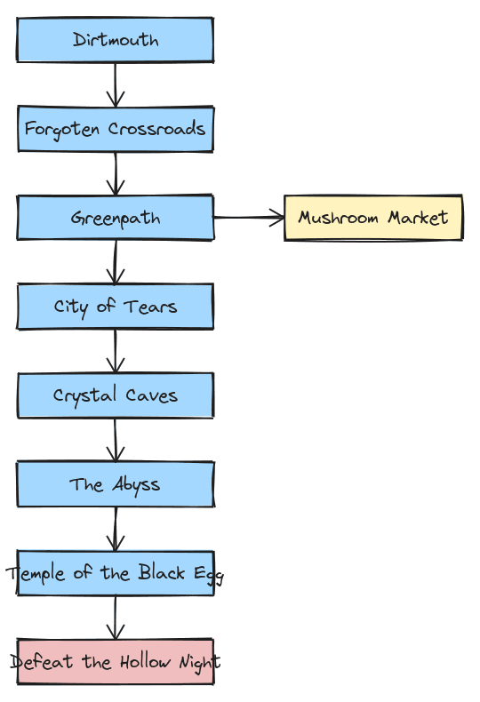
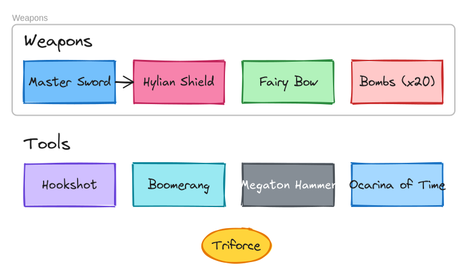

# excalirender Examples

Each folder demonstrates a command with a different game/series theme. Every `.excalidraw` file is valid and can be opened in [Excalidraw](https://excalidraw.com).

## Examples

| Example | Command | Theme | Preview |
|---------|---------|-------|---------|
| [export/](export/) | `excalirender` | Super Mario Bros |  |
| [diff-gif/](diff-gif/) | `excalirender diff` | Hollow Knight |  |
| [info/](info/) | `excalirender info` | Legend of Zelda |  |
| [combine/](combine/) | `excalirender combine` | Pokemon |  |
| [recursive/](recursive/) | `excalirender -r` | Lord of the Rings |  |

## Quick Start

```bash
# Export a diagram to PNG
excalirender examples/export/mario-level.excalidraw -o mario.png

# Visual diff as animated GIF
excalirender diff examples/diff-gif/old.excalidraw examples/diff-gif/new.excalidraw -o diff.gif

# File metadata
excalirender info examples/info/zelda-inventory.excalidraw

# Side-by-side comparison
excalirender combine examples/combine/team-red.excalidraw examples/combine/team-blue.excalidraw --labels -o starters.png

# Batch convert a directory
excalirender -r examples/recursive/ -o ./output/
```

## Piping (stdin/stdout)

Any `.excalidraw` file can be piped through stdin/stdout:

```bash
# Read from stdin
cat examples/export/mario-level.excalidraw | excalirender - -o mario.png

# Write to stdout
excalirender examples/export/mario-level.excalidraw -o - > mario.png

# Full pipe
cat examples/export/mario-level.excalidraw | excalirender - -o - > mario.png

# Diff with a git revision
git show HEAD~1:diagram.excalidraw | excalirender diff - diagram.excalidraw -o diff.png
```
