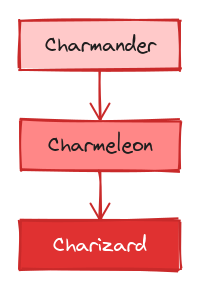
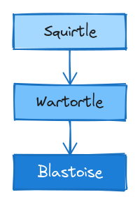

# Combine Example: Pokemon Starters

Two Pokemon evolution chain diagrams — fire (red) and water (blue) — designed for side-by-side comparison with the `combine` command.

| Team Red | Team Blue |
|:--------:|:---------:|
|  |  |

## Files

- `team-red.excalidraw` — Charmander → Charmeleon → Charizard (red/orange gradient)
- `team-blue.excalidraw` — Squirtle → Wartortle → Blastoise (light to dark blue)

## Commands

```bash
# Side by side (horizontal, default)
excalirender combine team-red.excalidraw team-blue.excalidraw -o starters.png

# Stacked (vertical)
excalirender combine team-red.excalidraw team-blue.excalidraw --layout vertical -o starters-vertical.png

# With filename labels
excalirender combine team-red.excalidraw team-blue.excalidraw --labels -o starters-labeled.png

# Custom gap between diagrams
excalirender combine team-red.excalidraw team-blue.excalidraw --gap 80 -o starters-wide.png

# Dark mode
excalirender combine team-red.excalidraw team-blue.excalidraw --dark --labels -o starters-dark.png

# 2x scale
excalirender combine team-red.excalidraw team-blue.excalidraw --scale 2 -o starters-2x.png

# PDF output
excalirender combine team-red.excalidraw team-blue.excalidraw -o starters.pdf
```

## Evolution Chains

| Team Red | Team Blue |
|----------|-----------|
| Charmander (light red) | Squirtle (light blue) |
| Charmeleon (medium red) | Wartortle (medium blue) |
| Charizard (dark red) | Blastoise (dark blue) |

Each file has 8 elements: 3 rectangles with bound text + 2 connecting arrows.

> **Note:** The `combine` command requires excalirender with combine support. Each file can also be exported individually with the standard `excalirender` command.
