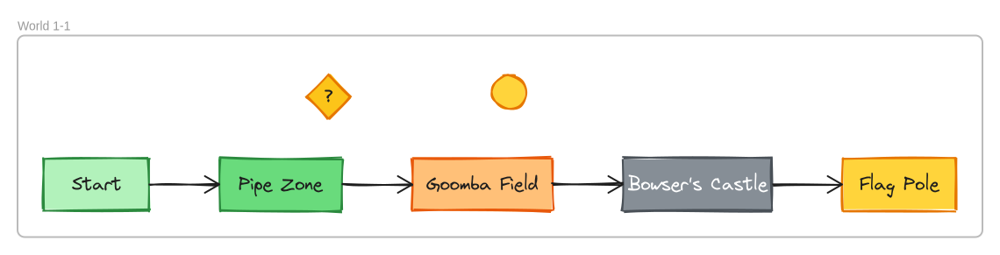

# Export Example: Super Mario Bros Level Map

A side-scrolling Super Mario Bros level layout demonstrating all export formats and options.



## File

- `mario-level.excalidraw` — World 1-1 level map with 5 stages (Start, Pipe Zone, Goomba Field, Bowser's Castle, Flag Pole), a "?" block, a coin, and a frame named "World 1-1"

## Output Formats

```bash
# PNG (default)
excalirender mario-level.excalidraw -o mario.png

# SVG
excalirender mario-level.excalidraw -o mario.svg

# PDF (vector, selectable text)
excalirender mario-level.excalidraw -o mario.pdf
```

## Rendering Options

```bash
# Dark mode
excalirender mario-level.excalidraw --dark -o mario-dark.png

# Transparent background
excalirender mario-level.excalidraw --transparent -o mario-transparent.png

# 2x scale (retina)
excalirender mario-level.excalidraw --scale 2 -o mario-2x.png

# Custom background color
excalirender mario-level.excalidraw -b "#1a1b26" -o mario-custom-bg.png

# Export only the "World 1-1" frame
excalirender mario-level.excalidraw --frame "World 1-1" -o mario-frame.png
```

## Piping (stdin/stdout)

```bash
# Read from stdin
cat mario-level.excalidraw | excalirender - -o mario.png

# Write to stdout
excalirender mario-level.excalidraw -o - > mario.png

# Full pipe
cat mario-level.excalidraw | excalirender - -o - > mario.png

# Stdout with format flag
excalirender mario-level.excalidraw -o - --format svg > mario.svg
```

## Elements

| Element | Type | Color | Description |
|---------|------|-------|-------------|
| Start | rectangle | green | Starting area |
| Pipe Zone | rectangle | dark green | Warp pipe section |
| Goomba Field | rectangle | orange | Enemy area |
| Bowser's Castle | rectangle | grey | Boss fortress |
| Flag Pole | rectangle | gold | Level end |
| ? | diamond | yellow | Question block |
| (coin) | ellipse | gold | Collectible |
| World 1-1 | frame | — | Wraps all elements |

**18 elements total.** All elements are inside the "World 1-1" frame, so `--frame "World 1-1"` exports only the frame contents.
